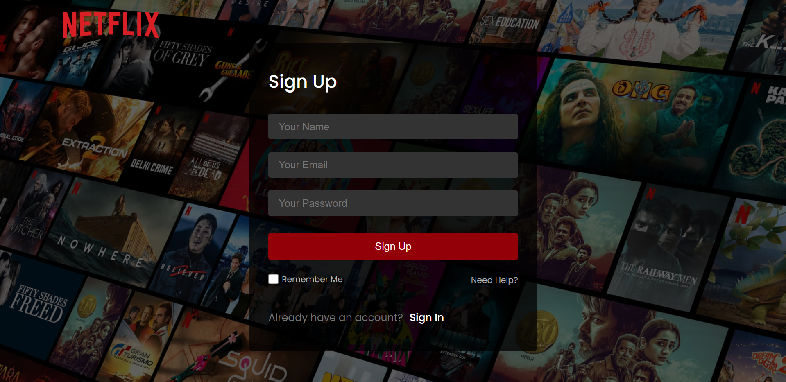
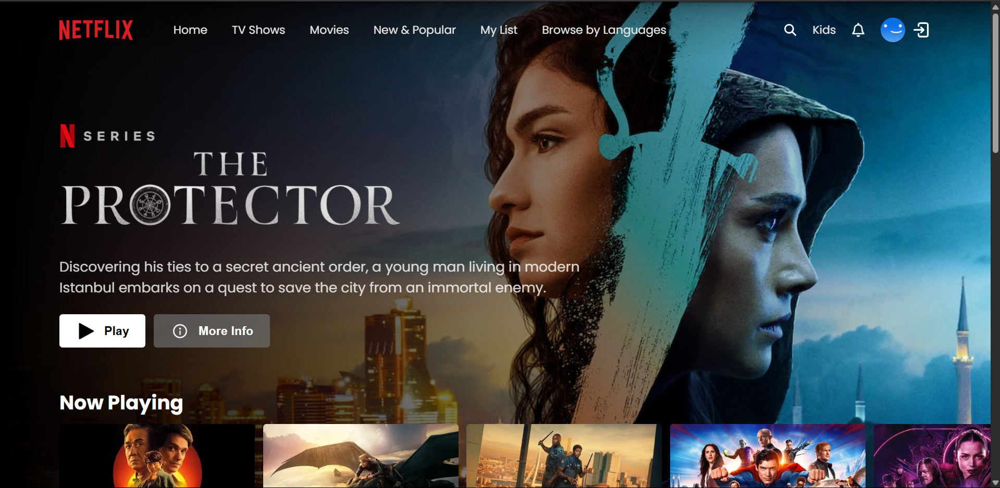
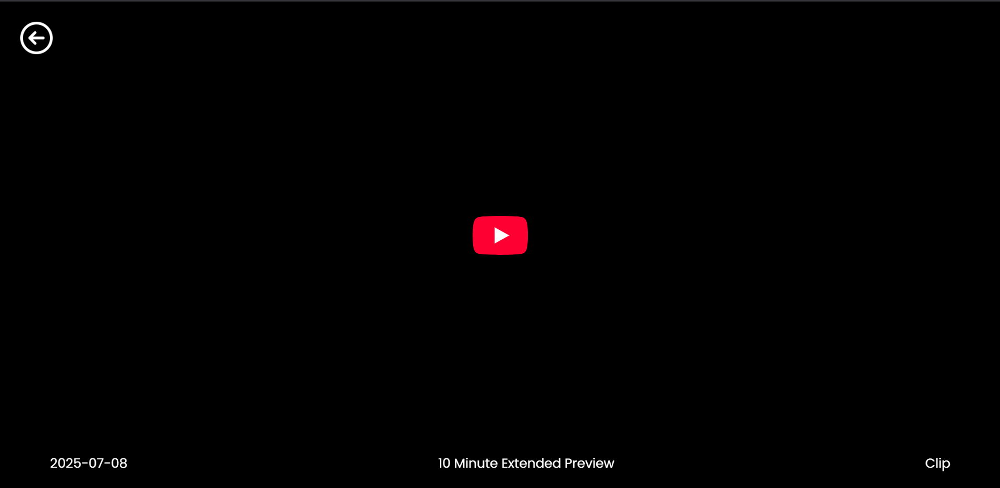

## Netflix Clone
A responsive Netflix-inspired web application built with React that allows users to browse and play movie trailers using TMDB (The Movie Database) API, authenticate via Firebase, and receive feedback with React Toastify notifications.

## ❤️Intent
This intermediate project was built to learn React fundamentals, component-based architecture, and state management. It also focuses on integrating and handling external APIs like TMDB for real-time movie data, along with implementing Firebase Authentication for user login functionality.

## Features
- User Authentication using Firebase (Sign Up / Sign In / Sign Out)
- Dynamic Movie Data from TMDB API
- Movie trailer player embedded from YouTube
- Categorized movie sections (e.g., Trending, Top Rated)
- Hero banner
- Toast notifications with React Toastify
- Fully responsive UI

## Tech Stack
- React.js	Frontend framework
- TMDB API for Movie and TV data source
- Firebase Auth	for User authentication
- React Toastify for Toast messages for feedback
- CSS for	UI Styling

## Screenshots
- Login Sign Up Page

- Home Page

- Video Player

## Acknowledgements
- TMDB API
- Firebase
- React Toastify
- Free Assets

## Future TODOs
- Add user watchlist
- Implement user profiles
- Improve trailer player with better fallback
- Use Redux or Context API for state management

## License
This project is open source and free to use.
